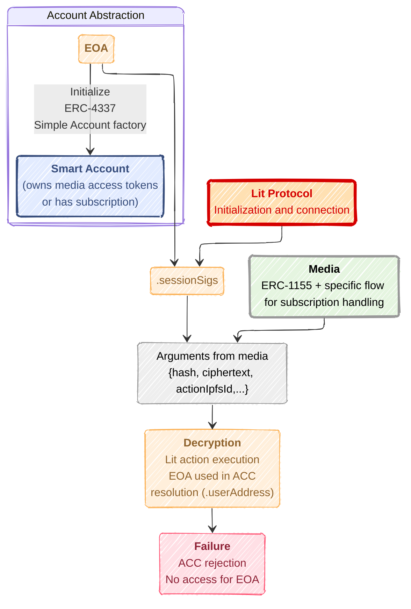

## -- title: Lit Protocol Implementation for Smart Account

# Lit Protocol implementation for Smart Account



Here is a simplified flowchart of how it is implemented.

The main use of Lit protocol here is to store in a decentralized and secure way
the CEK (Content Encryption Key). We rely on ACC mechanism to achieve the
ownership and condition for user to get access to it. Also, we perfom such a
process via Lit action which holds a Auth context where the connected user is
resolved.

```json
{
  conditionType: "evmBasic",
  contractAddress: "ipfs://....",
  standardContractType: "LitAction",
  chain: chain,
  method: "hasAccessByContentId",
  parameters: [":userAddress", kid, authority, rpc],
  returnValueTest: { comparator: "=", value: "true" }
}
```

The connected user here is always the EOA, ultimately we are seeking for a way
to make the Lit action to be executed as the smart account (enable to create
proper .sessionSigs)

already checked the
[EIP-1271 suggested](https://github.com/LIT-Protocol/developer-guides-code/tree/wyatt/eip-1271-contract/eip-1271/nodejs)
which is a signature verification flow seemingly.
